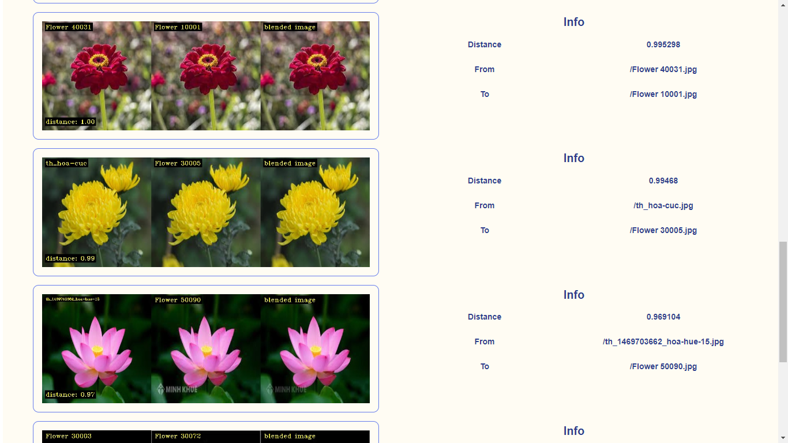
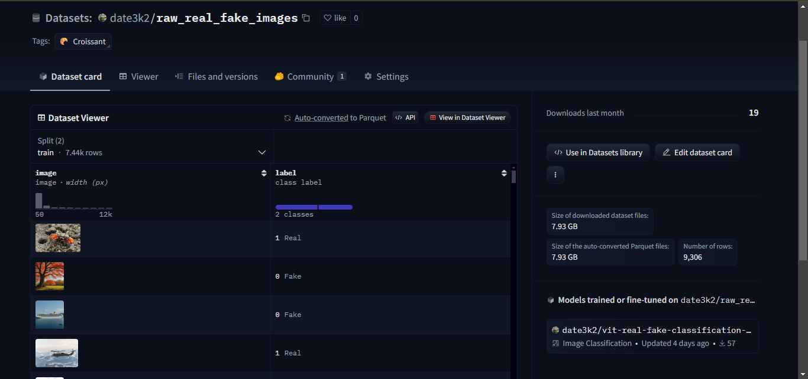
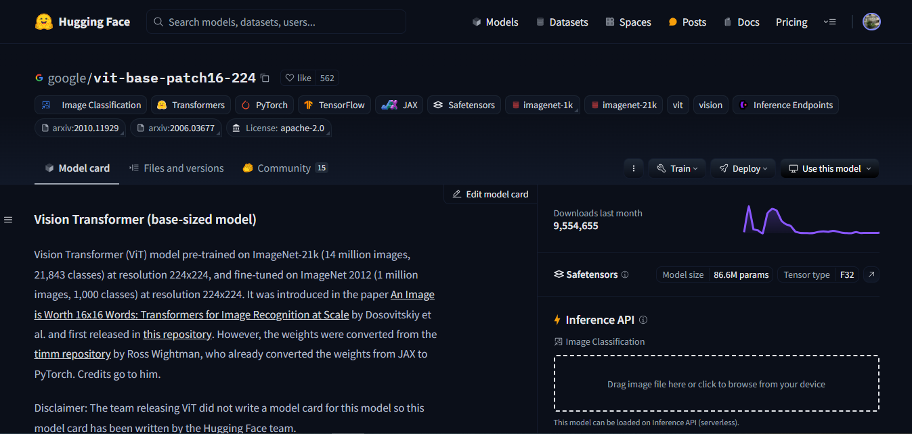
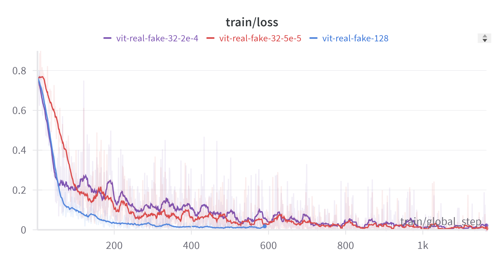

# Bài tập lớn môn học "Nhập môn học máy và khai phá dữ liệu"
## Đề tài: Phân loại ảnh do AI tạo và ảnh thật
## Phương pháp thực hiện
### Mô hình
Kiến trúc: Vision Transformer (ViT) trong bài báo [An Image is Worth 16x16 Words: Transformers for Image Recognition at Scale](https://arxiv.org/abs/2010.11929)
### Dữ liệu:
Ảnh được thu thập gồm hai loại: ảnh do AI tạo và ảnh thật, gồm các đối tượng: Car, Tree, Bird, Aquatic, Ship, Airplane, Dog, Cat, Flower.
- Ảnh do AI tạo: được các thành viên trong nhóm tạo ra bằng cách sử dụng mô hình tạo sinh mã nguồn mở trên Huggingface Hub, tận dụng GPU của Google Colab để tăng tốc độ tạo ảnh.

- Ảnh thật: được crawl từ các nguồn khác nhau trên Internet

Số lượng: mỗi loại đối tượng có khoảng 900 ảnh thật và 900 ảnh do AI tạo. Tổng khoảng 15000 ảnh.
### Tiền xử lý dữ liệu
Ảnh sau khi thu thập được lọc để loại bỏ những ảnh nhiễu và có độ tương đồng cao sử dụng thư viện [fastdup](https://github.com/visual-layer/fastdup)

Sau khi tiền xử lý, còn 9306 ảnh, trong đó 5118 ảnh thật và 4188 ảnh do AI tạo. Dữ liệu được upload trên Huggingface Hub [tại đây](https://huggingface.co/datasets/date3k2/raw_real_fake_images)

### Huấn luyện
- Khởi tạo: Finetune mô hình [ViT](https://huggingface.co/google/vit-base-patch16-224) đã được pretrain trên tập dữ liệu ImageNet của Google trên Huggingface Hub.

Dữ liệu được chia thành 2 tập train và test theo tỉ lệ 80-20.

Tham số huấn luyện:
- learning_rate: 5e-5
- train_batch_size: 128
- eval_batch_size: 128
- seed: 42
- optimizer: Adam with betas=(0.9,0.999) and epsilon=1e-08
- lr_scheduler_type: linear
- lr_scheduler_warmup_ratio: 0.1
- num_epochs: 10

## Kết quả

Kết quả huấn luyện:
| Training Loss | Epoch | Step | Validation Loss | Accuracy | F1     | Recall | Precision |
|:-------------:|:-----:|:----:|:---------------:|:--------:|:------:|:------:|:---------:|
| 0.1759        | 1.0   | 59   | 0.2212          | 0.9173   | 0.9229 | 0.8978 | 0.9495    |
| 0.1903        | 2.0   | 118  | 0.1047          | 0.9629   | 0.9659 | 0.9503 | 0.9819    |
| 0.0463        | 3.0   | 177  | 0.0824          | 0.9699   | 0.9730 | 0.9834 | 0.9628    |
| 0.0015        | 4.0   | 236  | 0.0763          | 0.9764   | 0.9787 | 0.9825 | 0.9749    |
| 0.0631        | 5.0   | 295  | 0.0794          | 0.9737   | 0.9759 | 0.9640 | 0.9880    |
| 0.0114        | 6.0   | 354  | 0.0582          | 0.9801   | 0.9819 | 0.9786 | 0.9853    |
| 0.0004        | 7.0   | 413  | 0.0662          | 0.9807   | 0.9824 | 0.9796 | 0.9853    |
| 0.0231        | 8.0   | 472  | 0.0713          | 0.9753   | 0.9773 | 0.9659 | 0.9890    |
| 0.0017        | 9.0   | 531  | 0.0518          | 0.9817   | 0.9834 | 0.9796 | 0.9872    |
| 0.0268        | 10.0  | 590  | 0.0385          | 0.9839   | 0.9855 | 0.9903 | 0.9807    |

Kết quả tốt nhất trên tập test:
- Loss: 0.0398
- Accuracy: 0.9866
- F1: 0.9878
- Recall: 0.9854
- Precision: 0.9902

Hàm loss:  

Các model được upload lên Huggingface Hub [tại đây](https://huggingface.co/collections/date3k2/vit-665ec6ff045fcbf12bbbbe1d)

Link demo [tại đây](https://huggingface.co/spaces/date3k2/vit-real-fake-classification-v2)

### Thư viện sử dụng
- Transformers, Pytorch, Accelerate, Tokenizers: load mô hình và huấn luyện
- Diffusers: sinh ảnh do AI tạo
- Datasets: load dữ liệu
- Evaluate: đánh giá mô hình
- Wandb: theo dõi quá trình huấn luyện
